# ネットワークアーキテクチャ 10/2

## メールが届かない！
* 相手に届いてるけど、読まずに捨ててる（！）
* サーバまでは届いてる
* サーバまでも届いてない
* 送信できてない

## TCP State (RFC793)
### 接続確立
* CLOSED (未接続、TCBもない)
* LISTEN (接続要求待ち)
* SYN-RECEIVED (SYN受信後)
* SYN-SENT (SYN送信後)
* ESTABLISHED (接続確立、通信する状態)

### 接続終了
* FIN-WAIT-1 (FIN送信後)
* FIN-WAIT-2 (FIN送信&受信後)
* CLOSE WAIT (FIN受信後)
* LAST-ACK (CLOSE WAIT→FIN送信後)
* CLOSED (TIME WAIT→TCB削除、LAST-ACK→ACK受信)

## シーケンス番号は何番から始まる？
* 古い実装: 4μsごとのタイマ値
  * 4μs × 232 = 4.55時間
  * パケットの最大生存時間 (MSL: Maximum Segment Lifetime) は多くの実装では2分
* 新しい実装: ISN = M + F(localhost, localport, remotehost, remoteport)、Fはハッシュ関数など

* 3ウェイハンドシェイク
  1. SYN: 送信側の開始シーケンス番号=x
  2. SYN/ACK: 受信側の開始シーケンス番号=y、Ack=x+1 （Ack:次に送って欲しいシーケンス番号）
  3. ACK: Ack=y+1

### 開始シーケンス番号は固定値ではいけない
* 1パケットだけ大きく遅延した場合、開始シーケンス番号が固定だと不具合
  * 切断後、同一ポートを再利用した時、そのパケットが受信されてしまう
  * TIME-WAITとも関係する
  * セキュリティの問題 (ホストベース認証の場合)
    * A': Aになりすましたホスト
    * B: telnetとかのサーバ (A以外からの送信はブロックする)
    * A: Bを操作できるホスト
    * A'はBの返信を知ることはできないが、開始シーケンス番号を知っていればなりすまして送信できる
    1. A': SYN Seq=0 -> B
    2. B: SYN/ACK Seq=0 Ack=1 -> A
    3. A': ACK Seq=1 Ack=1 -> B
    4. A'はAになりすましてコマンドなどを送信する
    * 実際には・・・
    1. A': SYN Seq=x -> B
    2. B: SYN/ACK Seq=y Ack=x+1 -> A
    3. A'はSeq=yを受信できないので、Ack=y+1を送れない

## TCP状態図

