# ネットワークアーキテクチャ 10/9

## TCPの特徴
* コネクション型
* 信頼性を有する
* ストリーム型
* フロー制御を有する
  * スライディング・ウィンドウ方式

### コネクション型通信
* コネクションの確率: 3方向ハンドシェーク
* コネクションの維持: 再送、破棄、half-open connectionからの復帰
  * 破棄: すでに受け取ったパケットや壊れているパケットは破棄する
* コネクションの閉鎖: CLOSE

### misc
* データオフセット×4B
* FIN: もう **こちらからは上位層のデータを送ることがない** と通知するためのフラグ
  * なので、 **FINを送ったあとも上位層のデータを受信することがある**

### ストリーム型
* パケットの順序が入れ替わることも紛失することもよくあること
  * TCPは受信側で順序正しくデータを並べかえたり、送信側で再送したりする

### フロー制御
* TCPはウィンドウサイズ（受け取れるデータ量）を相手局に通知する
  * 送信側は、相手のウィンドウサイズを考えながら、信頼性と効率を確保するためにスライディング・ウィンドウ方式でウィンドウ制御する

### スライディング・ウィンドウ方式
* 送信側のウィンドウ制御
  * 送信バッファを使う
  * ACKを待たず、まとめて送信

### 再送制御
* 再送制御は
  * 受け取ったら、ACKを返す
  * ACKが来なかったら再送
* この２つで再送制御を実現できる？

## 今日の注意点と復習
* 参考書や今日の授業では１方向のみを解説
  * たとえば、ウィンドウ（現在の受信可能サイズ）は双方向に送信される（A→B, B→A)
